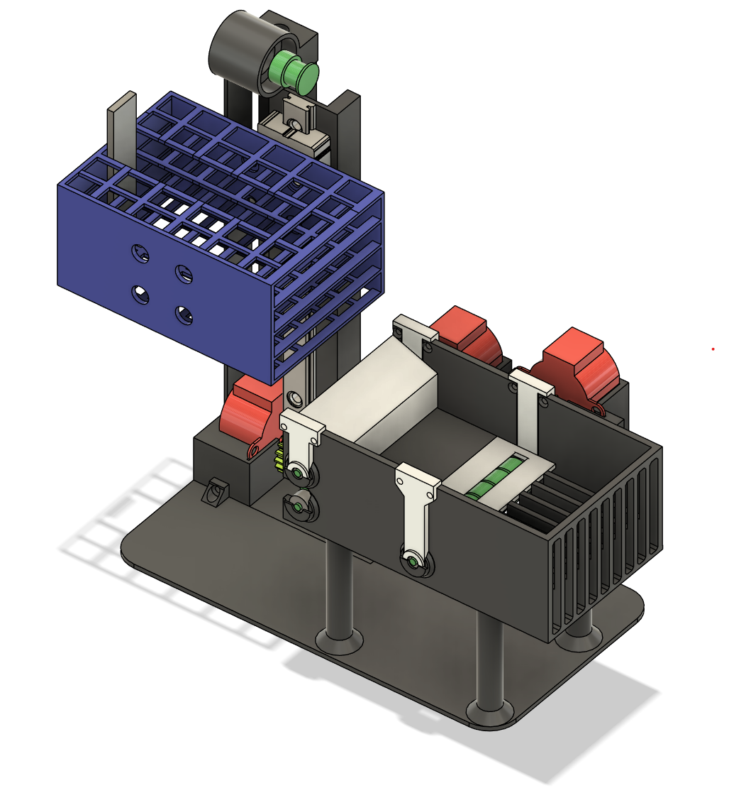

# 🃏 Automatic Card Shuffler – Engineering Project  

This project aimed to design and build a functional **automatic card shuffler** intended for use in card games.  
The main goal was to create a prototype capable of efficiently shuffling cards while being modular and user-friendly.  

## 🎯 Project Goals  
- Build a **mechanical structure** for automatic card shuffling using **3D modeling**  
- Develop **Arduino-based control software** for easy modification and feature expansion  
- Design an **electronic interface** for user parameter adjustment and status monitoring  
- Implement a **safety/emergency mode** to ensure reliable and secure operation  

## 📌 Results  
- ✅ Fully functional card shuffler prototype completed  
- ✅ Electronic interface allows monitoring and control of the shuffling process  
- ✅ Mechanical structure designed, 3D printed, and assembled  
- ⚡ Limitations: low-power motors reduce speed and torque, requiring stronger motors for improved reliability  

## 🚀 Future Improvements  
- Integration of **WiFi module** for remote control via mobile application  
- Implementation of a **vision system** to detect and arrange cards automatically  
- Development of a **card distribution system** configurable for number of players and cards  

## 🛠️ Tools & Resources  
- **Arduino IDE** for programming (C/C++ derivative)  
- Personal **3D printer** for mechanical components  
- 3D modeling software for design and simulation  
- Standard electronic components (motors, microcontrollers, sensors)  

## 📷 Project Screenshots  
  
  
